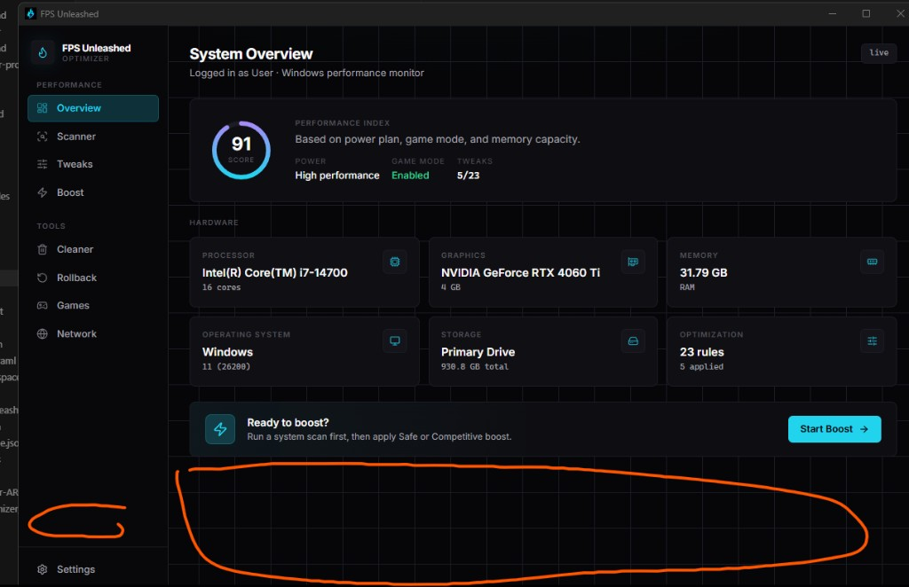

[English](README.md) · **ไทย**

# FPS Unleashed



**แอปปรับแต่ง Windows สำหรับประสิทธิภาพการเล่นเกม** — พัฒนาด้วย **Tauri 2**, **React 19** และ **Rust**

| | |
|---|---|
| **เวอร์ชัน** | 0.1.0 |
| **แพลตฟอร์ม** | Windows 10 / 11 (x64) |
| **ภาษา** | [English](README.md) · ไทย |

---

## สารบัญ

1. [FPS Unleashed คืออะไร](#fps-unleashed-คืออะไร)
2. [เริ่มใช้งาน](#เริ่มใช้งาน)
3. [โครงสร้างโปรเจกต์](#โครงสร้างโปรเจกต์)
4. [โมดูลและฟีเจอร์](#โมดูลและฟีเจอร์)
5. [รายการ Tweaks (31 รายการ)](#รายการ-tweaks-31-รายการ)
6. [โหมด Boost](#โหมด-boost)
7. [ระบบ Expert Guide](#ระบบ-expert-guide)
8. [ความปลอดภัย Rollback และข้อมูล](#ความปลอดภัย-rollback-และข้อมูล)
9. [การพัฒนา](#การพัฒนา)
10. [Build และ Release](#build-และ-release)

---

## FPS Unleashed คืออะไร

FPS Unleashed เป็นแอป Windows ที่อ่าน **ฮาร์ดแวร์จริง** ของคุณ (CPU, GPU, RAM, BIOS, โหมดพลังงาน) แล้วช่วยปรับระบบให้เหมาะกับการเล่นเกม — อย่างปลอดภัยและ **ย้อนกลับได้**

### ประโยชน์หลัก

| ประโยชน์ | FPS Unleashed ช่วยอย่างไร |
|---------|---------------------------|
| **FPS สูงขึ้น** | ปรับ power plan, Game Mode, GPU max performance, ล้าง shader cache, ลดบริการเบื้องหลัง |
| **เฟรมลื่นขึ้น** | ลดสาเหตุสตั๊ตเตอร์ (telemetry, DVR, visual FX, RAM standby) |
| **ลด input lag** | MMCSS profile, timer resolution, priority 0x26, fullscreen optimizations, low-latency GPU |
| **เน็ตเสถียรขึ้น** | ล้าง DNS, ปิด NIC power saving, ปรับ Nagle/throttling + ทดสอบ ping ในตัว |
| **รู้ก่อนปรับ** | Scanner ให้คะแนนเครื่องและแนะนำโหมด Boost ที่เหมาะ |
| **คุมความเสี่ยงได้** | แสดงระดับความเสี่ยงทุก tweak, revert ได้, Rollback ทั้งหมด + restore point |
| **สำหรับมือโปร** | คู่มือ BIOS/HAGS/undervolt พร้อมตรวจขั้นตอนจริง — ไม่เปลี่ยนค่าอัตโนมัติ |
| **สองภาษา** | ไทย / อังกฤษ ในหน้าหลัก (Tweaks, Boost, Settings, Expert Guide) |

ทุกอย่างทำงาน **บนเครื่องคุณเอง** ผ่าน Rust — ไม่มีคลาวด์ ไม่ต้องสมัครสมาชิก ไม่ใช่แท็บเบราว์เซอร์ที่อ้างว่าปรับ registry ให้

---

## เริ่มใช้งาน

### สำหรับผู้ใช้ทั่วไป

1. เปิดโฟลเดอร์ `release/`
2. **พกพา:** ดับเบิลคลิก `FPS Unleashed.exe`
3. **ติดตั้ง:** รัน `FPS Unleashed Setup.exe` หรือ `FPS Unleashed.msi`
4. หรือดับเบิลคลิก `Run FPS Unleashed.bat` ที่ root โปรเจกต์ (ชี้ไป `release\FPS Unleashed.exe`)

> **แนะนำ:** คลิกขวา → **Run as administrator** เพื่อให้ registry, services, restore point และการตั้งค่าพลังงานทำงานครบ

### โฟลเดอร์ release (อัปเดตล่าสุดเสมอ)

หลัง build แต่ละครั้ง `release/` ควรมี **แค่ 3 ไฟล์นี้**:

| ไฟล์ | ใช้ทำอะไร |
|------|----------|
| `FPS Unleashed.exe` | แอปพกพา — ไม่ต้องติดตั้ง |
| `FPS Unleashed Setup.exe` | ตัวติดตั้ง NSIS |
| `FPS Unleashed.msi` | แพ็กเกจ Windows Installer |

---

## โครงสร้างโปรเจกต์

```
FPS Unleashed/
├── src/                    # React + TypeScript UI
│   ├── pages/              # หนึ่งหน้าต่อหนึ่งเมนู
│   ├── components/         # Layout, dashboard, tweaks, boost
│   ├── data/               # Tweaks, boost presets, expert guides
│   ├── i18n/               # ข้อความ EN + TH
│   └── context/            # TweakProvider (สถานะ tweak ทั้งแอป)
├── src-tauri/              # Rust backend (Tauri commands)
│   └── src/
│       ├── tweaks/         # เครื่องมือ apply / revert
│       ├── hardware*.rs    # WMI + อ่าน VRAM GPU
│       ├── scanner.rs      # ตรรกะสแกนระบบ
│       ├── restore.rs      # Restore point + rollback
│       ├── cleaner.rs      # ล้างไฟล์ขยะ
│       ├── games.rs        # ตรวจจับเกม
│       ├── network.rs      # ทดสอบ ping
│       ├── advisor.rs      # ตรวจขั้นตอน Expert Guide
│       └── store.rs        # เก็บ state (JSON)
├── release/                # ไฟล์ปล่อยพร้อมใช้
├── assets/                 # โลโก้และสื่อ
├── docs/                   # เอกสารเพิ่มเติม
├── build-exe.bat           # Build + copy ไฟล์ 3 ชิ้นไป release/
└── Run FPS Unleashed.bat   # เปิด exe แบบพกพา
```

**ที่เก็บข้อมูล:** `%LOCALAPPDATA%\fps-unleashed\state.json`

---

## โมดูลและฟีเจอร์

แถบด้านข้างแบ่งเป็น **Performance** และ **Tools**

### Overview (แดชบอร์ด)

**เส้นทาง:** `/`

แดชบอร์ดแสดงข้อมูลระบบสด จากการอ่านฮาร์ดแวร์จริง (WMI + `nvidia-smi` / registry สำหรับ VRAM ที่แม่นยำ)

| ส่วน UI | แสดงอะไร |
|---------|----------|
| **Performance Index** | คะแนน 0–100 จาก power plan, Game Mode, tweak ที่ apply, RAM และระดับ GPU |
| **Power / Game Mode / Tweaks** | โหมดพลังงาน, Game Mode เปิด/ปิด, จำนวน tweak `ที่ใช้/ทั้งหมด` |
| **Hardware grid** | CPU, GPU (+ VRAM), RAM, OS, ที่เก็บข้อมูล, สรุปการปรับแต่ง |
| **System Details** | ผู้ผลิต/เวอร์ชัน/serial/วันที่ BIOS, ความเร็ว DRAM (MHz), ความเร็ว CPU (MHz) |
| **Ready to boost?** | แบนเนอร์ลัดไปหน้า Boost |

---

### Scanner (สแกนระบบ)

**เส้นทาง:** `/scanner`

วิเคราะห์ระบบ **ก่อน** apply tweak

**ผลลัพธ์:**
- **FPS Gain** — ศักยภาพเพิ่ม FPS (ต่ำ / กลาง / สูง)
- **Latency Gain** — ศักยภาพลด latency เน็ตและ scheduler
- **Stability Risk** — ความเสี่ยงถ้าใช้ tweak แรง
- **Recommended Mode** — แนะนำ Safe / Competitive / Extreme / Maintenance
- **Performance score** — คะแนน 0–100 พร้อมลิงก์ไป Boost ที่เหมาะ
- **Findings list** — สถานะรายข้อ (`ok` / `warn`), หมวด, คำแนะนำ

**ตรวจรวมถึง:** Game Mode, power plan, ขนาด/ความเร็ว RAM, VRAM GPU, telemetry, Xbox DVR, fullscreen optimizations, HAGS, VBS, XMP headroom, จำนวน tweak ที่ apply แล้ว และอื่นๆ

---

### Tweaks (ปรับแต่ง)

**เส้นทาง:** `/tweaks`

ควบคุม **31 กฎการปรับแต่ง** แบ่ง 5 แท็บ:

| แท็บ | จำนวน | โฟกัส |
|-----|-------|-------|
| Windows | 11 | OS, พลังงาน, MMCSS, system.ini latency |
| GPU | 6 | Shader cache, max perf, low latency, คู่มือ HAGS |
| CPU | 5 | Priority, core parking, timer resolution, คู่มือ undervolt |
| Network | 4 | DNS, NIC power, Nagle, throttling index |
| Advanced | 5 | Fan curve, standby RAM, VBS, memory integrity, คู่มือ XMP |

แต่ละแถวแสดง:
- ป้ายความเสี่ยง (Safe → Extreme)
- ต้อง Admin / Restart / Restore point หรือไม่
- สวิตช์ apply / revert
- **Open Guide** สำหรับ tweak แบบคู่มือ (ไม่ apply อัตโนมัติ)

---

### Boost (บูสต์ครั้งเดียว)

**เส้นทาง:** `/boost`

ชุด preset กดครั้งเดียว apply หลาย tweak ต่อเนื่อง

| โหมด | ความเสี่ยง | จำนวน tweak | เหมาะกับ |
|------|-----------|-------------|----------|
| **Safe Boost** | ต่ำ | 7 | ทุกคน — ใช้ประจำได้ |
| **Competitive Boost** | กลาง | 18 | จริงจัง/esports — FPS + latency |
| **Extreme Boost** | สูง | 22 | สูงสุด — ต้องระบายความร้อนดี + restore point |
| **Expert Guide** | สูงสุด | คู่มือ 4 เรื่อง | BIOS / OC — **ไม่ apply อัตโนมัติ** |

ขั้นตอน:
1. สร้าง restore point (ถ้าเปิดใน Settings)
2. ยืนยันความเสี่ยงสำหรับ Competitive / Extreme
3. Apply เป็นชุด พร้อมรายงานสำเร็จ/ล้มเหลวทีละ tweak
4. Expert เปิด **checklist** พร้อมตรวจขั้นตอนจริง

---

### Cleaner (ล้างไฟล์)

**เส้นทาง:** `/cleaner`

ล้างไฟล์ขยะ — เลือกเป้าหมายแล้วรัน:

| ตัวเลือก | การทำงาน |
|---------|----------|
| Temporary files | โฟลเดอร์ temp ของ Windows และผู้ใช้ |
| Shader cache | แคช DirectX / GPU (ช่วยแก้สตั๊ตเตอร์หลังอัปเดตไดรเวอร์) |
| DNS cache | ล้าง resolver (`ipconfig /flushdns`) |
| Recycle bin | ล้างถังขยะ |

แสดงพื้นที่ที่ว่าง (MB) และรายการที่ล้าง

---

### Rollback (ย้อนกลับ)

**เส้นทาง:** `/restore`

ศูนย์ความปลอดภัย:

- **Create Restore Point** — จุดคืนค่า Windows System Restore
- **Last boost** — เวลาที่ apply Boost ล่าสุด
- **Applied tweaks list** — รายการ tweak ที่แอปเปลี่ยน พร้อมสถานะ revert
- **Rollback All** — ย้อนกลับทุก tweak ที่ apply ในครั้งเดียว

---

### Games (โปรไฟล์เกม)

**เส้นทาง:** `/games`

ตรวจเกมที่ติดตั้งและแสดง preset แข่งขัน:

| เกม | การตรวจจับ | โปรไฟล์มี |
|-----|------------|----------|
| Apex Legends | Steam / EA | FPS cap, priority, หมายเหตุ launch |
| Valorant | Riot Client | หมายเหตุการตั้งค่าแข่งขัน |
| Counter-Strike 2 | Steam | Launch options, priority |
| Fortnite | Epic Games | หมายเหตุประสิทธิภาพ |

แสดงป้าย **Installed / Not found** — auto-apply ตอนเปิดเกมยังวางแผนไว้ ใช้ Tweaks + Boost ก่อน

---

### Network (เครือข่าย)

**เส้นทาง:** `/network`

เครื่องมือ latency:

- **Flush DNS** — ล้างแคช DNS
- **Adapter Power Off** — ปิด power saving การ์ดเครือข่าย
- **Ping test** — ทดสอบ host ใดก็ได้ (ค่าเริ่ม `8.8.8.8`) แสดง latency ms และ packet loss %

ลิงก์ไปหน้า Tweaks สำหรับ Nagle / throttling index

---

### Settings (ตั้งค่า)

**เส้นทาง:** `/settings`

| การตั้งค่า | ค่าเริ่มต้น | ผล |
|-----------|-------------|-----|
| **ภาษา** | English | ภาษา UI (EN / ไทย) — สลับได้ที่ sidebar ด้วย |
| **สร้าง restore point ก่อน Boost** | เปิด | ถามก่อน Competitive / Extreme |
| **ยืนยัน tweak ความเสี่ยงสูง** | เปิด | แจ้งเตือนเพิ่มก่อน action ที่เสี่ยง |

แสดงโหมดรัน (Tauri desktop / browser preview) และ path โฟลเดอร์ข้อมูล

---

### สลับภาษา (Sidebar)

เหนือ **Settings** ในแถบด้านข้าง:

- ปุ่ม **ไทย** / **EN**
- sync กับ Settings → ภาษา
- หน้า Tweaks, Boost, Expert Guide, Settings แปลครบ; Scanner / Cleaner / Network / Games ยังเป็นภาษาอังกฤษใน v0.1.0

---

## รายการ Tweaks (31 รายการ)

### Windows (11)

| ID | ชื่อ | ทำอะไร |
|----|------|--------|
| `win-game-mode` | เปิด Game Mode | ให้ความสำคัญกับโปรเซสเกม ลดการรบกวนจากเบื้องหลัง |
| `win-power-high` | โหมดพลังงาน High Performance | สลับไปแผนพลังงานประสิทธิภาพสูง |
| `win-visual-fx` | ปิด Visual Effects | ปิดแอนิเมชันและความโปร่งใส |
| `win-game-dvr` | ปิด Xbox Game Bar DVR | หยุดการบันทึกเบื้องหลังที่กิน FPS |
| `win-telemetry` | ปิด Telemetry Services | ลดบริการเก็บข้อมูล DiagTrack |
| `win-fullscreen-opt` | ปิด Fullscreen Optimizations | อาจลด input lag แต่บางเกมอาจฉีกขาด |
| `win-bg-apps` | จำกัด Background Apps | หยุดแอป UWP ที่ไม่จำเป็นรันเบื้องหลัง |
| `win-disable-power-saving` | ปิด Power Saving ทั้งหมด | CPU 100%, USB suspend off, PCIe ASPM off, ดิสก์ไม่ sleep, NIC save off |
| `win-priority-26` | Win32 Priority Separation (0x26) | โปรไฟล์ scheduler แข่งขัน (0x26) |
| `win-mmcss-latency` | MMCSS Gaming Profile | System Responsiveness 0, Games priority สูง, Lazy Mode timeout |
| `win-system-ini-fps` | system.ini Latency Profile | ปรับ `[386Enh]` time-slice; สำรอง system.ini ก่อน |

### GPU (6)

| ID | ชื่อ | ทำอะไร |
|----|------|--------|
| `gpu-shader-cache` | ล้าง DirectX Shader Cache | ลบแคชชเดอร์เก่า (ล้างอย่างเดียว — ปลอดภัย) |
| `gpu-max-perf` | Prefer Maximum Performance | ตั้ง NVIDIA/AMD เป็น max performance |
| `gpu-low-latency` | Low Latency Mode | เปิดเส้นทาง low-latency ของไดรเวอร์ |
| `gpu-hags-advisor` | ตรวจ HAGS | **คู่มือเท่านั้น** — อ่าน registry แนะนำ ON/OFF ตาม GPU |
| `gpu-power-limit` | GPU Power Limit | ปรับ power limit ผ่านเครื่องมือผู้ผลิต |
| `gpu-clock-offset` | GPU Clock Offset | ปรับ core/memory offset — ผิดค่าอาจ crash หรือ BSOD |

### CPU (5)

| ID | ชื่อ | ทำอะไร |
|----|------|--------|
| `cpu-game-priority` | Game Process High Priority | เพิ่ม priority โปรเซสเกมที่รันอยู่ |
| `cpu-core-parking` | ปิด CPU Core Parking | ให้ทุกคอร์ตื่น — กินไฟ idle มากขึ้น |
| `cpu-timer-res` | Timer Resolution (Gaming) | ขอ timer 0.5 ms ขณะเล่นเกม |
| `cpu-undervolt` | คู่มือ CPU Undervolt | **คู่มือเท่านั้น** — checklist ทีละขั้น |
| `cpu-power-limit` | CPU Power Limit (PL1/PL2) | ปรับ power limit ผ่านเครื่องมือผู้ผลิต |

### Network (4)

| ID | ชื่อ | ทำอะไร |
|----|------|--------|
| `net-dns-flush` | ล้าง DNS Cache | ล้างแคช resolver |
| `net-adapter-power` | ปิด Adapter Power Saving | ป้องกัน NIC sleep / ping กระโดด |
| `net-nagle` | ปิด Nagle's Algorithm | อาจลด latency ในบางเกมออนไลน์ |
| `net-throttling` | Network Throttling Index | ปรับ multimedia network throttling ของ Windows |

### Advanced (5)

| ID | ชื่อ | ทำอะไร |
|----|------|--------|
| `adv-fan-curve` | Fan Curve Tuning | ปรับเส้นโค้งพัดลมผ่านเครื่องมือผู้ผลิต |
| `adv-ram-standby` | Standby Memory Cleaner | ล้าง standby list เมื่อ RAM แน่น |
| `adv-vbs-warn` | ตรวจ VBS / Core Isolation | **คู่มือเท่านั้น** — ตรวจ VBS อธิบาย trade-off FPS |
| `adv-vbs-disable` | ปิด Memory Integrity | อาจเพิ่ม FPS แต่ **ลดความปลอดภัย** |
| `adv-bios-xmp` | คู่มือ XMP / EXPO | **คู่มือเท่านั้น** — ตรวจว่า RAM วิ่งต่ำกว่าที่ระบุหรือไม่ |

---

## โหมด Boost

### Safe Boost (7 tweaks)
`win-game-mode`, `win-power-high`, `win-visual-fx`, `win-bg-apps`, `gpu-shader-cache`, `cpu-game-priority`, `net-dns-flush`

ความเสี่ยงต่ำ — จุดเริ่มต้นที่ดีสำหรับทุกเครื่อง

### Competitive Boost (18 tweaks)
เพิ่มปิด DVR, telemetry, fullscreen opt, GPU max perf + low latency, timer resolution, NIC power, Nagle off และชุด latency power (`win-disable-power-saving`, `win-priority-26`, `win-mmcss-latency`)

ความเสี่ยงกลาง — **แนะนำ restore point**

### Extreme Boost (22 tweaks)
เพิ่มปิด core parking, network throttling, `win-system-ini-fps`, standby RAM cleaner

ความเสี่ยงสูง — อาจ BSOD หรือไม่เสถียรบางเครื่อง — **ควรมี restore point**

### Expert Guide (คู่มือเท่านั้น)
เปิด checklist: HAGS, CPU undervolt, ตรวจ VBS, คู่มือ XMP/EXPO BIOS

- **ไม่เปลี่ยน** BIOS, แรงดัน หรือ clock อัตโนมัติ
- ตรวจขั้นตอนได้ผ่าน WMI/registry
- ตัวเลือก **ยอมรับความเสี่ยง — ข้ามคู่มือ** บันทึกใน `state.json`

---

## ระบบ Expert Guide

Tweak แบบคู่มือ **ไม่แก้ค่าอันตรายอัตโนมัติ** แต่จะ:

1. แสดง **checklist** ทีละขั้นพร้อมสรุปความเสี่ยง
2. ปุ่ม **Verify** ตรวจ registry/WMI ต่อขั้น
3. **Waiver** — ผู้ใช้ขั้นสูงยอมรับความเสี่ยงแล้วข้ามได้ (เก็บใน `state.json`)

คู่มือ: HAGS, CPU Undervolt, VBS / Core Isolation, XMP / EXPO BIOS

---

## ความปลอดภัย, Rollback และข้อมูล

| หัวข้อ | FPS Unleashed จัดการอย่างไร |
|--------|------------------------------|
| Tweak ย้อนกลับได้ | ส่วนใหญ่เก็บค่าเดิมและ revert ได้ |
| ย้อนกลับทีเดียว | หน้า Rollback → **Rollback All** |
| Windows restore | สร้าง restore point ก่อน Boost หรือด้วยตนเอง |
| ระดับความเสี่ยง | ป้าย Safe / Medium / High / Extreme ทุก tweak |
| สิทธิ์ Admin | จำเป็นสำหรับ registry, services, power plan |
| ไฟล์ state | `%LOCALAPPDATA%\fps-unleashed\state.json` |

**คำเตือน:** tweak ระดับ Extreme, undervolt และ BIOS อาจทำให้ crash หรือสูญเสียข้อมูล — สร้าง restore point และรู้วิธีย้อนกลับเสมอ

---

## การพัฒนา

**ต้องมี:** Node.js 22+, pnpm, Rust (stable), Visual Studio C++ Build Tools 2022

```powershell
cd FPS Unleashed
pnpm install
pnpm tauri dev
```

| คำสั่ง | ใช้ทำอะไร |
|--------|----------|
| `pnpm tauri dev` | UI hot-reload + Rust backend |
| `npx tsc --noEmit` | ตรวจ TypeScript |
| `pnpm build` | build frontend อย่างเดียว |

**สแต็ก:** Tauri 2 · React 19 · React Router 7 · Tailwind CSS 4 · Lucide icons · Rust `spawn_blocking` สำหรับ WMI/registry

---

## Build และ Release

```powershell
.\build-exe.bat
```

สคริปต์นี้:
1. ติดตั้ง dependencies
2. ตรวจ TypeScript
3. รัน `pnpm tauri build`
4. คัดลอก **3 ไฟล์** ไป `release/`:
   - `FPS Unleashed.exe`
   - `FPS Unleashed Setup.exe`
   - `FPS Unleashed.msi`
5. ลบไฟล์เก่าที่ค้าง (installer เวอร์ชันเก่า)

---

## License

โปรเจกต์ส่วนตัว — ดูเงื่อนไขการแจกจ่ายจากเจ้าของ repository
